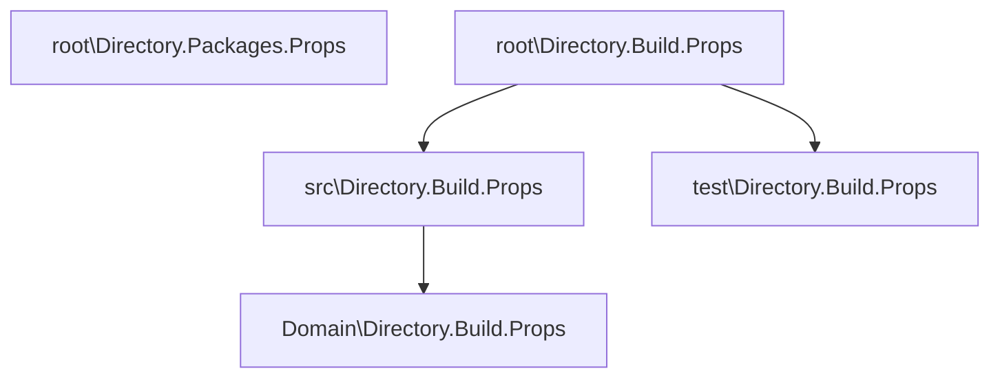

# Introduction

When I started at my current position it was mentioned that components are build according to Domain Driven Design.
While I have worked with pattern and practices that are also part of DDD, I never really worked with DDD as a whole.

This project is a playground to learn more about DDD and how to implement it in a .NET project.
Here I try to find my ideal project setup, including my preferred way of handling cross cutting concerns like logging, validation, etc.

How can I find the right balance between a dogmatic or more pragmatic approach to DDD? (there seem to many contradicting opinions on this topic)

## Project Structure

First I started by creating a folder structure with a separate folders for test projects and the actual implementation.
This allows me to define a global [`Directory.Build.props`](Directory.Build.Props) file to define global project rules, and a more specific package and analyzers rules in the sub folders:

- [`Directory.Build.props for implementation`](src/Directory.Build.Props).
- [`Directory.Build.props for Test projects`](test/Directory.Build.Props).

Both files inherit the [`Directory.Build.props`](Directory.Build.Props) file in the root of the project to define global project rules.
Inheritance is done with the following line:
`xml <Import Project="$([MSBuild]::GetPathOfFileAbove('Directory.Build.props', '$(MSBuildThisFileDirectory)../'))" /> `

The Directory.Build.Props and project file only contain the required packages, versions are managed with [Central package management](https://learn.microsoft.com/en-us/nuget/consume-packages/Central-Package-Management).
This has the added advantage that als package version are defined in one place: [`Directory.Packages.Props`](Directory.Packages.Props).
I have structured the file to seperate packages needed for test and added specific version pinnen to avoid vulnerable or deprecated packages.

<!-- [](https://mermaid.live/edit#pako:eNotjDkOgzAQRa9iTQ0XcJEi8gmAzqYY2eOA5CUyY6EIcfeYkF-9_2Y5wGZHIMGHvNsFC4vnZJJoUVrliGuaRd8_xKi3Yud7Mv7MoIec-a-mWzW6OnQQqbRj1z4flzHAC0UyIBs68lgDGzDpbKtYOY-fZEFyqdRBfTtkUiu-CkaQHsNG5xfEGTSE) -->



To make sure dependency injection can be setup in the responsible project I added a [`DependencyInjection`](src/DependencyInjection.cs) file in each project (with one exception that I'll mention later).
Additionally each project has a AssemblyReference class to get easy access to the Assembly of the project.

### EditorConfig

To make sure all developers use the same code style, I added a [`EditorConfig`](.editorconfig) file to the root of the project. This file is used by Visual Studio and ReSharper to define the code style.
At th bottom of the file some specific rules are overridden for the test projects.

## Cross Cutting Concerns

I think it's important for a component to handle the following cross cutting concerns:

- Logging (Application Insights)
- Health checks
- Validation
- Exception handling
- Docker support
- optional: Database support (EF Core)
- optional: API documentation with Swagger (in case of a Web API)

The last 2 are optional, but since most project I work on are Web API's with a database, I added them to the list.

### Logging

My main requirement for logging is that it should log to Application Insights, with the possibility to log to the console and the [Application Insight Search](https://learn.microsoft.com/en-us/azure/azure-monitor/app/diagnostic-search) window during development.

In this project I use the default Microsoft configuration without depending on third party packages. I tried a [SeriLog approach](https://youtu.be/nVAkSBpsuTk?si=Qq2b_ifOAp6wt_Rj) in a earlier version, but I don't really see the benefits to what is offered in the natively.
I intent to compare this to other other approaches at a later stage.

I Added a sample [LoggingPipelineBehavior](src/Application/_/Behaviors/LoggingPipelineBehavior.cs) to test adding properties to alle messages within a scope.
This could also be done with Middleware in a API project, but putting this responsibility in the Application layer, makes it usable in scenario's where ASP.Net would not be used.

### Health checks

For ASP.Net applications I use the [AspNetCore.HealthChecks](https://learn.microsoft.com/en-us/aspnet/core/host-and-deploy/health-checks?view=aspnetcore-7.0) package to setup health checks.
This package allows you to setup health checks for the application itself, but also for external dependencies like a database or a message queue.
To configure this cleanly the health checks are added through the dependencyInjection classes I mentioned earlier. That way each project can define it's own health checks.

Additionally I created a extension method to map the health endpoint:

```csharp
public static class HealthCheckExtensions
{
    public static void MapHealthChecks(this IEndpointRouteBuilder endpoints)
    {
        endpoints.MapHealthChecks("/_health/live", new HealthCheckOptions
        {
            // Exclude all checks, just return a 200.
            Predicate = _ => false

            // Their may be some checks that you want to include here...
        }).AllowAnonymous();

        // The state endpoint returns a 200 if all checks are passing, otherwise a 500.
        // Degraded is considered passing.
        endpoints.MapHealthChecks("/_health/state").AllowAnonymous();

        // The details endpoint returns a 200 if all checks are passing, otherwise a 500.
        // It also returns a json payload with the results of each check.
        endpoints.MapHealthChecks("/_health/details", new HealthCheckOptions
        {
            ResponseWriter = UIResponseWriter.WriteHealthCheckUIResponse
        }).AllowAnonymous();
    }
}
```

I chose to configure 3 endpoints:

- /\_health/live: This endpoint returns a 200 if the application is running, but does not check the health of any dependencies.
- /\_health/state: This endpoint returns a 200 if the application is running and all dependencies are healthy.
- /\_health/details: This endpoint returns a 200 if the application is running and all dependencies are healthy. It also returns a json payload with the results of each check.

In Program.cs I added the following lines to configure the health checks:

```csharp
// Add health checks and forward the builder and configuration to the dependencyInjection class.
builder.Services.AddHealthChecks().AddDependencies(config);

// Use the extension method to map the health endpoints.
app.MapHealthChecks();
```

```
⚠️ TODO: At a later stage I'll look into possibilities to monitor the health of the application in Azure. Looks like an App Service can be configured to consume the health endpoint.
Additionally I'll look into the possibility to push a health check information to Azure Application Insights. This may be a good way to monitor the health of the application in Azure.
```

I'm also considering if it would be a good idea to expose the health endpoints to Swagger. Could be useful during development.

### Validation

For validation I use the [FluentValidation](https://fluentvalidation.net/) package.
Since I use the [MediatR](https://github.com/jbogard/MediatR) package to implement the CQ(R)S pattern, I created a [`ValidationBehavior`](src/Application/Behaviors/ValidationBehavior.cs) to handle the validation.

This allows me to add validation to a command or query by adding a validator to the command or query file. For example:

```csharp
internal sealed class Validator : AbstractValidator<Command>
{
    public Validator()
    {
        RuleFor(c => c.Title).NotEmpty();
        RuleFor(c => c.Content).NotEmpty();
    }
}
```

The validation behavior will automatically validate the command or query before it is handled by the handler.
If the validation fails, a `ValidationException` is thrown, which is handled by the [`ExceptionBehavior`](src/Application/Behaviors/ExceptionBehavior.cs) to return a 400 Bad Request to the client.

### Exception handling

For an API component, like this one, exception handling is solved though middleware. The ExceptionBehavior handles all exceptions and returns the correct Http error code to the client.
If this was a component without an API I may have added a MediatR pipeline behavior to handle exceptions.

### Docker support

To run the application in a Docker container, I added a Dockerfile to the WepApi project. This Dockerfile is configured to run the application in a Linux container.
On solution level I added a docker-compose file to run the application and a SQL Server database in a container.
This allows me to run the application in a container on my local machine, but also in Azure. It also allows a developer to run the application without having to install any dependencies like SQL Server on his machine.

```
⚠️ TODO: I think .Net 7 got better support for Docker, so I'll look into that at some point.
```

### Database support

This sample project uses Entity Framework to access a database. The database is configured in a separate project, that is responsible for the data access.

### API documentation with Swagger

Swagger is a great tool to document your API. It also allows you to test your API.

```
⚠️ TODO... Some custom configuration was needed...
```

## Domain Driven Design

Above describes how the cross cutting concerns are implemented, but this solution is also build up using Domain Driven Design (DDD).

Following the guidelines of DDD, the project is build up in 4 layers:

- Domain
- Application
- Infrastructure
- Presentation

In this solution I chose to separate those in 2 folders: Core and External.

- Core contains the Domain and Application layers. They should not be dependent on or aware of any other the other layers. By focussing on the Domain and Application layers, the business logic is separated external dependencies.
- External contains the Infrastructure and Presentation layers. They are responsible for the external dependencies and the presentation of the application. There can be multiple Infrastructure and Presentation project. For example, you could have a WebApi and a ASP.Net Mvc project in the Presentation layer. Or you could have a SQL Server and a MongoDB project in the Infrastructure layer.

The Launcher project is used to tie everything together. I chose **not** to use the presentation layer to ty everything together, because it would make it harder to separate the presentation from the infrastructure. The launcher project should not depend on any infrastructure, it should delegate the initialization to the other projects.

For this template I added an '_' (underscore) folder to each project. This folder contains a building block each layer uses that could be moved to a package. By naming it with an '_' it is always the first folder in the project. I think this makes it clear that the folder is not part of the project, but is used to build the project. I did have to disable code analysis CA1707 to make this possible...

### Domain

Domain is the heart of the application. It contains the business logic and the domain models.
I added a specific Directory.Build.props file to the Domain folder to exclude the package dependencies all other project have.
By inheriting it from the Directory.Build.props file on solution level, it will still get the Analyzer packages that ensure code quality.

I would like to keep the Domain layer as clean as possible. It should make it easier to have good unit tests for the business logic.

The Domain project contains the following folders:

- Models: This folder contains the domain models (Aggregates, Entities and ValueObjects).
- Services: This folder contains the domain services. These are services that are part of the domain and are not specific to a feature. They can be used to handle logic that is not specific to a single aggregate.
- Repositories: This folder contains the interfaces for the repositories. Repositories should only exist for Aggregates and the implementation of the repositories should be in the Infrastructure layer.
- Events: This folder contains the domain events.
- Errors: By grouping the errors in a separate folder, it is easier to see which errors are used by the domain.

#### Result object

The domain models should not throw exceptions. They should be valid at all times. For this reason I chose to work with a Result object.
The Result object is a generic class that can be used to return a result or an error. It only support the Error struct, so all errors follow the same convention.

```
⚠️ TODO: There may be better implementations of the Result class. I'll look into that at a later stage.
```

#### ValueObjects for Id's

I chose to use ValueObjects for Id's, but I'm not sure if this is the best approach. While it does add some type safety, it also adds complexity...
My main goal would be that Aggregates only have access to the Id's of other Aggregates.

#### DebuggerDisplay

For easy debugging I added a DebuggerDisplay attribute to the domain models. This allows me to see the most important properties of the model in the debugger.

### Application

The Application project is build on top of the domain layer. It contains the commands, queries and events.
It is setup using MediatR to implement the CQ(R)S pattern. I chose to use the repository pattern for commands, but not for queries.
Queries get read only access to the database, so they can be optimized for performance.
This does create a dependency on Entity Framework in the Application layer, but I think that is acceptable. I prefer a pragmatic approach over a purist approach.
It is not possible to make database changes using the readonly DataContext, so commands are still forced to use the repository pattern.

Cross cutting concerns like validation and logging are implemented using MediatR pipeline behaviors, so that as a developer you can focus on the business logic.
Both Commands and Queries are validated using the FluentValidation package. This is done here, so the Domain layer does not have a dependency on the FluentValidation package.

The Application project has a folder for each feature. Each feature folder contains the commands and queries for that feature.
It could also contain the events for that feature, but I do not have a sample for that at the moment.

Depending on the requirements, the command and query side could be split into separate projects. Having a separate command and query api would allow you to scale them separately.
Another approach would be to have separate models for command and queries. The Domain models could be used for the commands while the queries would be based on for example [materialized views](https://learn.microsoft.com/en-us/azure/data-explorer/kusto/management/materialized-views/materialized-view-overview).
There are many ways to implement CQRS, so it is important to choose the right approach for your application. This template could still be a good starting for any of those approaches.

### Presentation

To test my domain and application layer I added an API project as presentation layer. I chose to use minimal API instead of controllers, just to see how that works.
It does seem to be a bit cleaner, but I do not yet see any real benefits compared to controllers... I does seem to be the direction Microsoft is heading, so I'll use it here to get some experience with it.

Not every application will require and API, but in my experience, it is the most common scenario. The UI would most likely be build using either Angular or React, which I may include in this template at a later stage. Depending on the consumer I would also consider using separate request and response models instead of using the ones from the Application layer. For now this API is enough to test the Domain and Application layers.

An interesting alternative may be to use a Blazor frontend. This would reduce the complexity as it would replace both the API and the UI with one single presentation project.
I do however have doubts related to the future of Blazor, so I'm not sure if I could recommend it at this point.

### Infrastructure

The Infrastructure layers are responsible for the external dependencies and the presentation of the application.
Each infrastructure project should have only one responsibility and should not be aware of the other infrastructure projects.

For this template I added an infrastructure project for the dependency to a SQL database.
I added these project to test this project template, but real projects may have different infrastructure or presentation requirements.
Thats why I will not focus on these projects, except for specific concerns:

- [Domain Event with Outbox pattern](src/Infrastructure.EF.Outbox/Outbox.md)

## Unit testing

Testing should not be the last thing you do, but it is last in this readme...

First of all, I think it is important to have good unit tests for the Domain project. It's the foundation of the application, so it should be tested well.
I do not like steering on Code coverage, but I do think it is important to have high test coverage for the Domain project (I would aim for at least 90% only from the Domain.Tests).

The Application project should also have good unit tests, but I would not aim for 90% coverage. I focussed on Command and Validator, and less on the Queries.
For both Domain and Application tests I tried to write the test based on the requirement I wan't to validate.
Each test method has a name that describes the requirement it is testing. This should make it easier to understand the test and to maintain them.

I do not recommend Integration tests, since they are expensive to maintain and slow to run. Sometimes they are needed, so I added them to this template to see how they could be implemented.
As they are setup in this template they can run in parallel using multiple docker containers and the ReSpawn package to reset the database.

## Resources and inspiration

While building this template I was inspired by the following resources:

- [Clean Architecture With .NET 6 And CQRS - Project Setup](https://www.youtube.com/watch?v=tLk4pZZtiDY&list=PLYpjLpq5ZDGstQ5afRz-34o_0dexr1RGa&index=1&t=219s)
- [Clean Architecture Project Setup From Scratch With .NET 7](https://www.youtube.com/watch?v=fe4iuaoxGbA&list=PLYpjLpq5ZDGstQ5afRz-34o_0dexr1RGa&index=32)
- [Clean Architecture With .NET 6 And CQRS - Project Setup](https://www.youtube.com/watch?v=B9ZUJN1Juhk)
- [Tame Your Domain Using THIS Powerful Tool!](https://www.youtube.com/watch?v=LbdPuo4zEHE)
- [Mastering DDD Aggregate Modeling With THESE 3 Steps](https://youtu.be/E2ctgrKhqBw)
